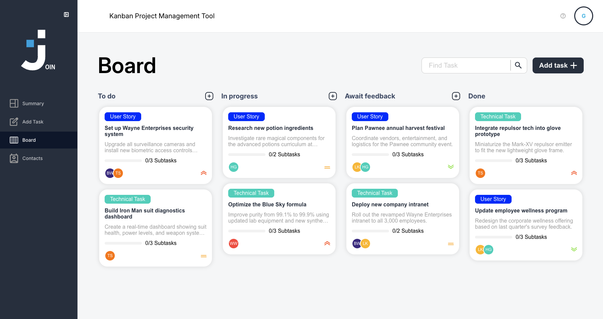

# 📋 Join

> **This is the frontend repository.** Join also needs its backend to run:
> **[lvfranek/join-backend](https://github.com/lvfranek/join-backend)** (Django REST API).
> Set up and start the backend first, then this app.

A task manager inspired by the Kanban system. Create and organize tasks using drag and drop, assign contacts and categories to keep your team aligned and productive. Built as an Angular single-page app that talks to a Django REST API.



## Table of Contents

- [Tech Stack](#tech-stack)
- [Features](#features)
- [Live Demo](#live-demo)
- [Installation](#️-installation)
- [Environment Variables](#environment-variables)
- [Available Scripts](#available-scripts)
- [Architecture](#architecture)
- [Tests](#tests)
- [Deployment](#deployment)
- [License](#license)

## Tech Stack

**Frontend (this repo)**

- `Angular` (standalone components, signals, lazy-loaded routes)
- `TypeScript`
- `SCSS`
- `Taiga UI`
- `Vitest`

**Backend ([join-backend](https://github.com/lvfranek/join-backend))**

- `Python` + `Django`
- `Django REST Framework` with token authentication

## Features

- **Kanban board**: create, edit and organize tasks in status columns.
- **Drag and drop**: move tasks between columns with the Angular CDK.
- **Task details**: priority, category, subtasks, due date and assigned contacts.
- **Contacts**: manage the people tasks can be assigned to.
- **Summary dashboard**: task counts per status and the next upcoming deadline.
- **Auth**: email registration and login with token authentication. Every account only sees its own contacts and tasks.
- **Guest login**: try the app without an account. Guest data stays in the browser and is never saved.
- **Demo data**: new accounts start with a set of example contacts and tasks.

## Live Demo

[join.franekkaminski.dev](https://join.franekkaminski.dev). Use "Guest login" to try it without an account.

## ⚙️ Installation

**Prerequisites:** Node.js 20+, npm 11+, and a running instance of the [Join backend](https://github.com/lvfranek/join-backend).

1. Set up and start the backend by following the [backend README](https://github.com/lvfranek/join-backend#installation). By default it runs on `http://127.0.0.1:8000`.

2. Clone this repository and install the dependencies:

   ```bash
   git clone https://github.com/lvfranek/Join.git
   cd Join
   npm install
   ```

3. Create your environment file:

   ```bash
   cp .env.example .env
   ```

   The default `API_URL` already points to the local backend.

4. Start the app:

   ```bash
   npm start
   ```

   Open `http://localhost:4200/`. The app reloads automatically when you change a source file.

## Environment Variables

The variable lives in `.env` at the project root. `npm start` and `npm run build` run `scripts/set-env.js`, which writes it into the generated Angular environment files (`src/environments/`).

| Variable | Description | Default |
|---|---|---|
| `API_URL` | Base URL of the Django REST API, without a trailing slash | `http://127.0.0.1:8000/api` |

When there is no `.env` file (for example on a build server), the script reads `API_URL` from the process environment instead.

## Available Scripts

| Command | What it does |
|---|---|
| `npm start` | Generates the environment files and serves the app on port 4200 |
| `npm run build` | Generates the environment files and builds to `dist/` |
| `npm run watch` | Development build that rebuilds on change |
| `npm test` | Runs the unit tests with Vitest |
| `npm run set-env` | Writes the Angular environment files from `.env` |

## Architecture

The Angular app never talks to a database directly. All data goes through the Django REST API.

```
Angular SPA ──── HTTP (JSON, token auth) ──── Django REST API ──── Database
```

- **Services** in `src/app/core/services` wrap the API: `AuthApiService` (register, login, logout, session restore), `ContactService` and `TaskService`.
- **Auth**: after login, the token is stored in `localStorage`. An HTTP interceptor (`core/interceptors/auth.interceptor.ts`) adds it as an `Authorization: Token …` header to every API request. On page reload, the session is restored by asking the API who the token belongs to.
- **Optimistic updates**: tasks are updated in the UI first and saved to the API in the background, so drag and drop feels instant.
- **Routing**: routes are lazy-loaded and split into a public shell (welcome, help, legal pages), an authenticated area guarded by `authGuard` (summary, board, add task, contacts) and an auth shell guarded by `guestGuard` (login, register).

## Tests

Unit tests cover the routed feature components and shared components. They run in jsdom via Vitest:

```bash
npm test
```

## Deployment

The app is built as static files and served by Nginx on a Google Cloud VM, next to the Django backend.

```bash
API_URL=https://join-api.franekkaminski.dev/api npm run build
```

The output in `dist/demo-join/browser` is served as a single-page app, with every unknown path falling back to `index.html`.

## License

MIT, see [LICENSE](LICENSE).
